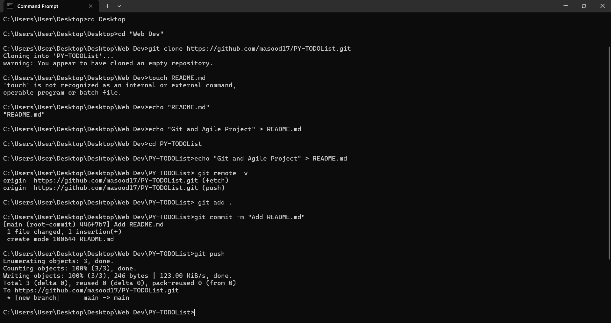
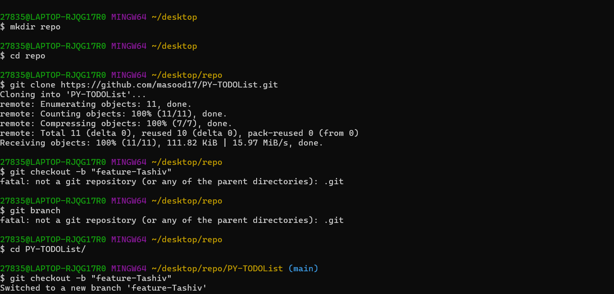

"Git and Agile Project" 

Team Members and Roles:

Mas-ood - Scrum master and developer
Tashiv  - Tester and developer

Agile Summary:

📋 Project Title: Simple To-Do List Application
A basic task management tool developed as a simulation of an Agile development environment, focusing on Sprint Planning and Git workflows.

🚀 Agile Sprint Plan Summary
This summary represents the commitment made during the Sprint Planning Session.

Sprint Goal: Successfully implement all core CRUD (Create, Read, Update, Delete) functionality for the To-Do List application.

User Story	Commitment Summary	Assigned Team Member(s)
US 1: Create a Task	| Implement the input form and API logic to save new tasks to the database.	Mas-ood
US 2: View Task List |	Implement the front-end list component and fetch tasks from the database to display them.	Mas-ood
US 3: Mark Task as Complete	| Implement a button/checkbox to update a task's status and apply a visual change (e.g., strikethrough).	Tashiv
US 4: Delete a Task	| Implement a delete button for each task and the necessary back-end logic to remove it permanently.	Tashiv (as developer)

